# Chicago CTA Metro line Crime Analysis
------------------------------------------------------------------------------------

#### Project done by Akshant Churi

------------------------------------------------------------------------------------



## 1. Introduction:
Chicago is one of the biggest cities in the United States and is home to more than 2.5 million people. When it 
rises in crime and violence, New York and Los Angeles are two major U.S. cities that experience comparable issues with homicide rates, but Chicago stands out as particularly problematic, with roughly 17 homicides per 100,000 people occurring in the years 2014 to 2015. This city is infamous for its gun violence and gang crimes, which are being driven by growing gun crime across America. 

With the help of public data and the power of data analytics tools available this research paper helps to answer questions like which CTA metro lines are riskier to travel, which type of crime is most common and what time of the day most crime occurs around metro stations. 

## 2. Methodology:

In this study, the data is collected from the Chicago data portal which allows free access to the government data. There are 2 main data sources which are:





Part 1: Analysis of Chicago Crime Dataset:

The crime dataset consists of more than 6 million rows of criminal cases involved from 2001 to 2022 along with the location’s latitude and longitude coordinates. There are a total of 35 unique crimes such as assault, robbery, gun violation etc. 

Figure 1 shows the top 5 popular crimes from the year 2001-2022. Figure 2 which is made using matplotlib Library in Python shows public peace violation in Chicago during the year 2011. The graph is made by plotting crime location points on the Chicago city basemap which was also available on the Chicago data portal website. The black dots in the graph represent the crime locations for the following year. Next, Figure 3 is a line chart which shows the trend for all crimes which took place from the year 2001-2022. As seen from the graph, the overall number of criminal cases have decreased overtime possibly due to better security measures which are taken by the city. Figure 4 explains the trend of Theft crimes from the year 2001-2022. Both Figure 2 & 3 have almost similar trends. 
    
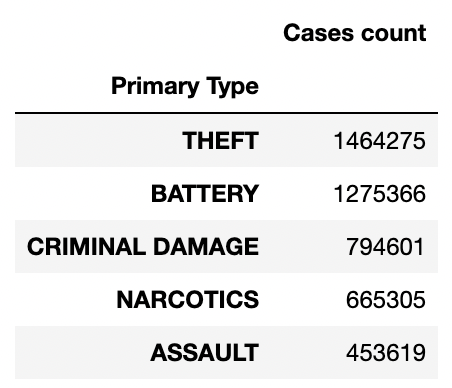

Figure 1: Top 5 popular crimes from 2001-2022                

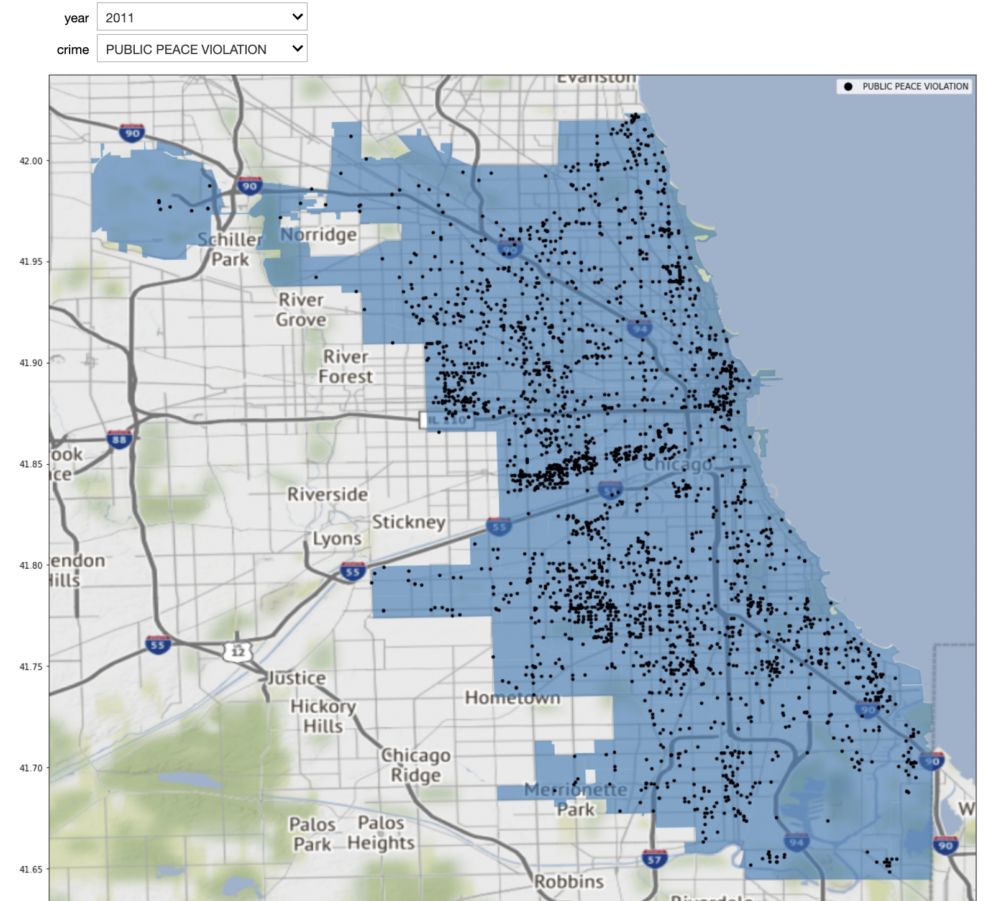

Figure 2: Public Peace Violation in the year 2011 (Graph made using Python)

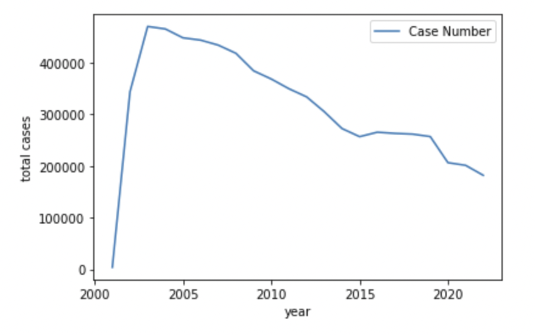
Figure 3: Trend of the crime cases from 2001-2022		

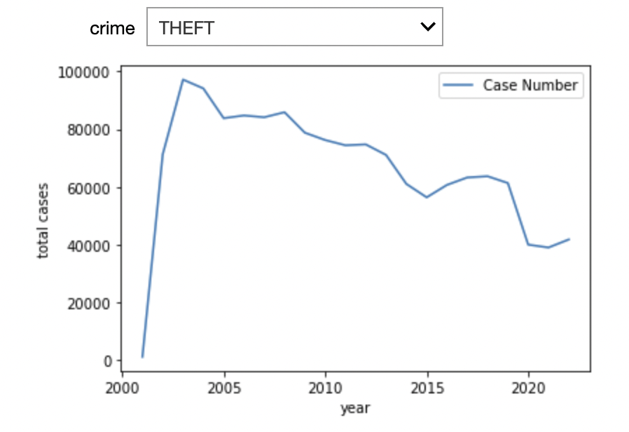
Figure 4: Trend of Theft cases only, from 2001-2022

Part 2: Analysis of Chicago CTA stations dataset:

This dataset has 300 rows with station information such as Id, name, direction, line and coordinates. Most of Chicago's CTA train stations consist of 2 platforms in direction North, South, East or West. Even though the directions are different for any station, the coordinates remain the same. For example as shown in Figure 5, Station Halsted has 2 platforms in the direction W and E, but the location for both the rows remains the same. Moreover, the G column has True value which suggests that the station is on the green line.

Figure 5: Information about Halsted Station

To avoid any duplicate values with the same coordinates for any station, I have considered the unique values of station ID. By Further preprocessing and manipulating the data using Pandas in Python, the following dataset is obtained as shown in Figure 6. In some scenarios multiple lines cross a single station, for instance, State/Lake station in the downtown Chicago region has 5 lines shown in Figure 7.

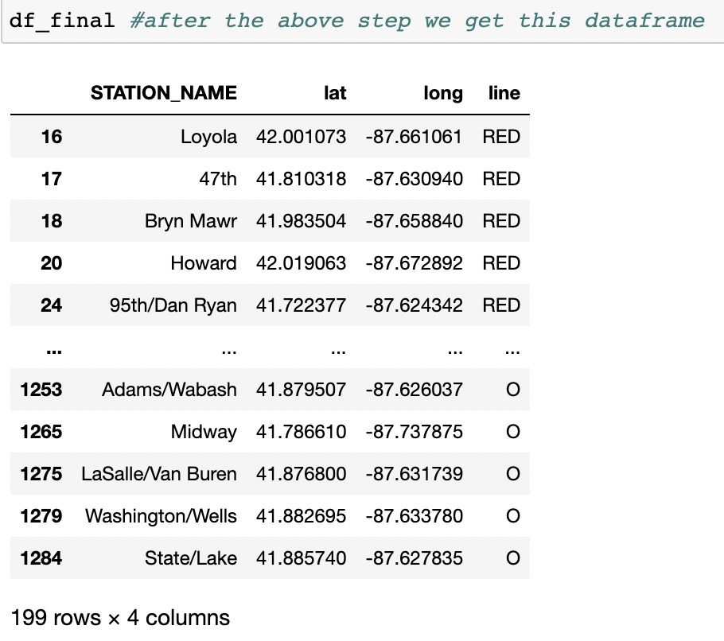
Figure 6: Preprocessed data				      

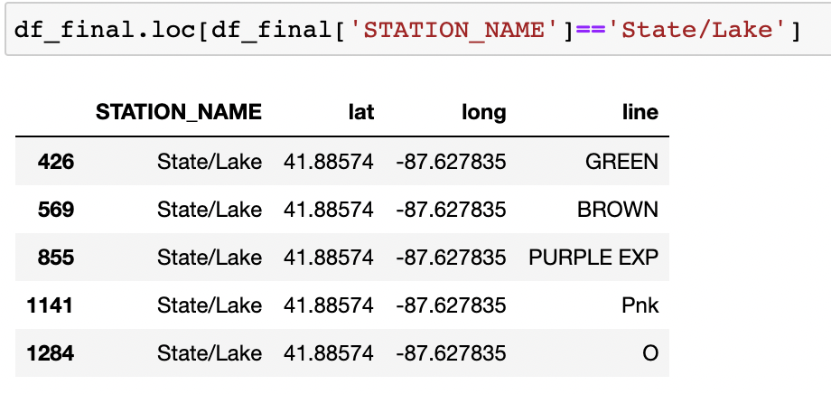
Figure 7: State/Lake station information

In total there are 8 different lines in Chicago which are Red, Blue, Brown, Green, Orange, Pink, Purple and Yellow. Figure 8 shows the count of stations on different lines. Plotting the latitude and longitude points and adding color in Tableau we get the following map chart as shown in Figure 9. As seen the Train lines are all connected in the downtown region and spread outwards in different regions of Chicago. A lot of people travel to the downtown region being a big financial center and hence a number of stations are present in this region which form a loop as shown in Figure 10. 
             
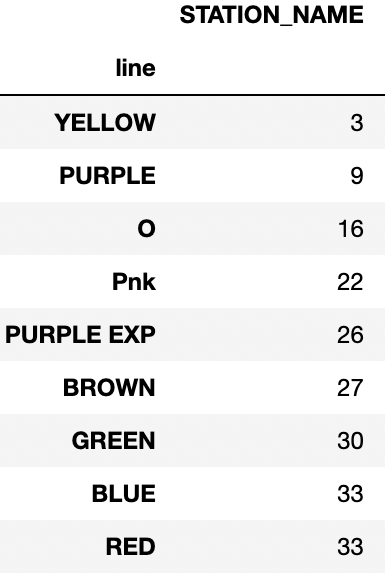
Figure 8: Count of Stations  on CTA train lines		    

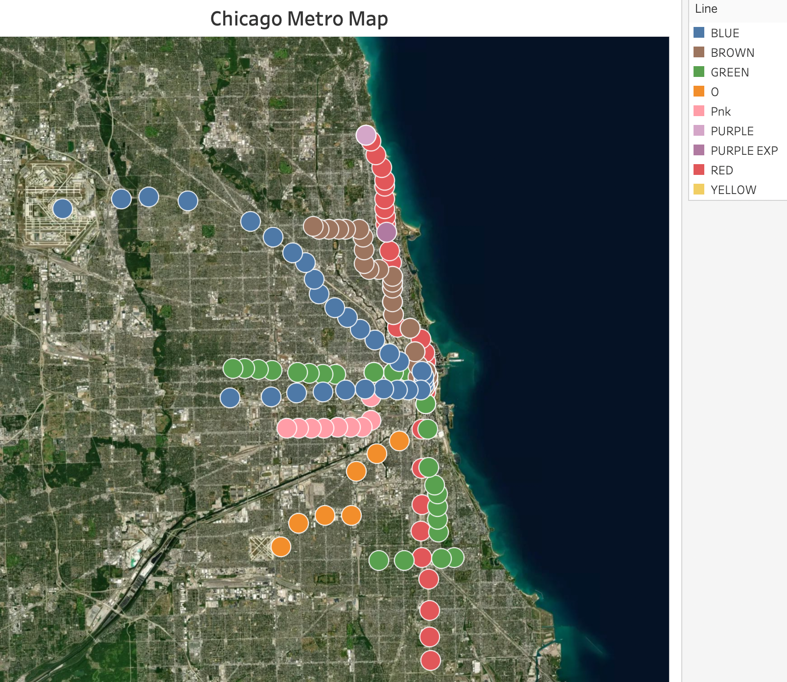
Figure 9: Chicago CTA Metro Lines map Plot using Tableau

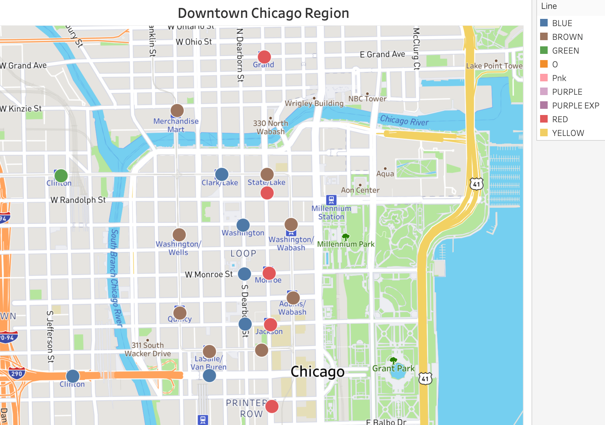	  
Figure 10a: Downtown Chicago Region made on Tableau

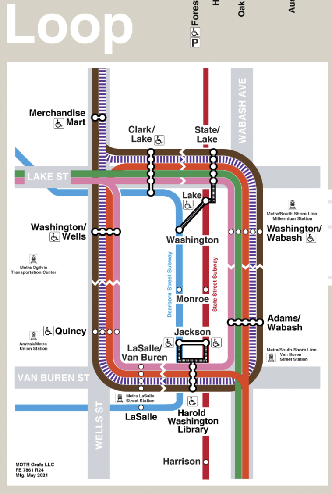	
Figure 10b: Official CTA train map, https://www.transitchicago.com/maps/

				

Part 3: Analysis by combining both the Dataset

To combine both the crime and CTA Train dataset, I have identified crime locations which are near to any CTA train station. In order to do so, I’m using the distance between the 2 points (crime location and CTA metro station location) which is calculated with the help of Geographiclib in Python. Using an ellipsoid model of the earth, this library can be used to solve geodesic problems. For this research purpose I have kept a threshold value of 500 meters. Meaning, only information about crime locations which are under 500 meters from the CTA train station will be stored and used for analysis.

## 3. Results and Discussion

The final combined dataset csv file is loaded in Tableau which allows easy visualization and understanding of data.

part a: Observation from the Map and Line charts.
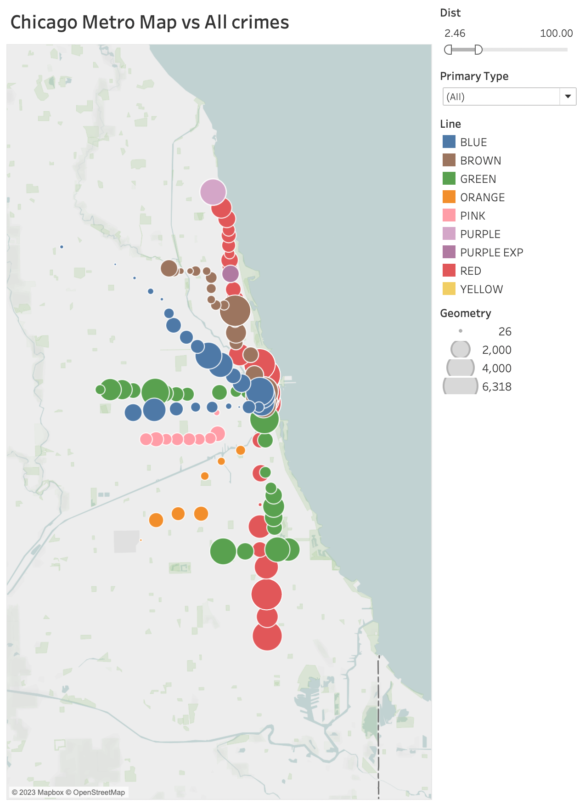	
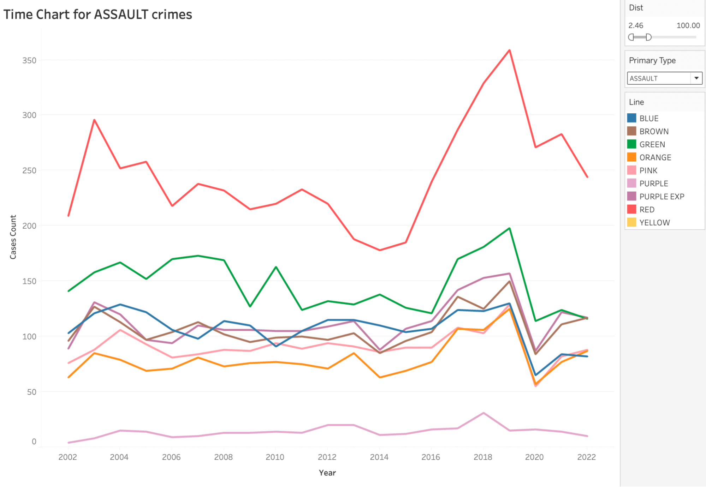	
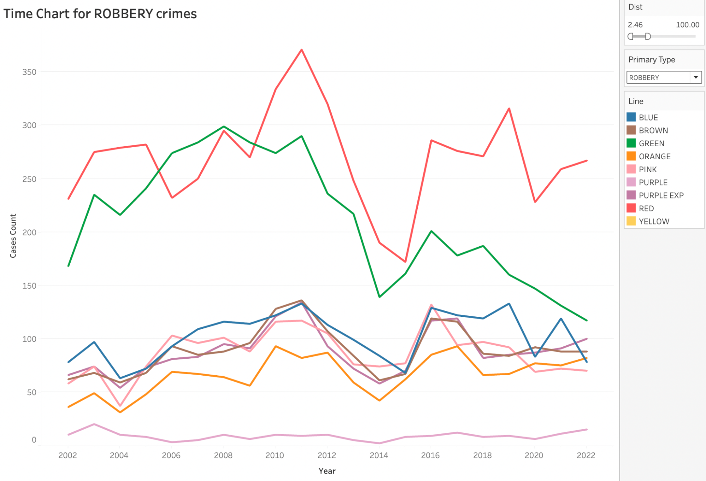	
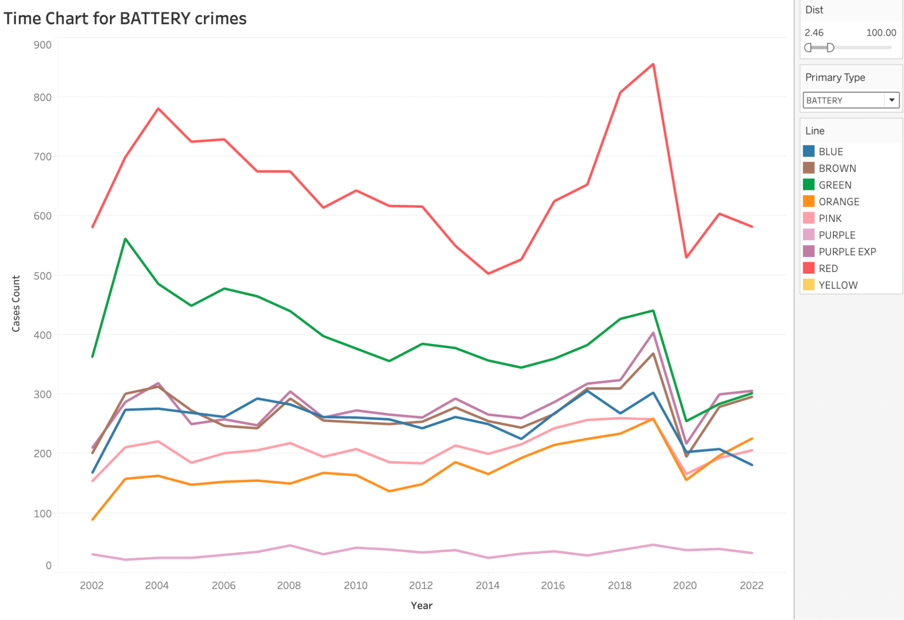	
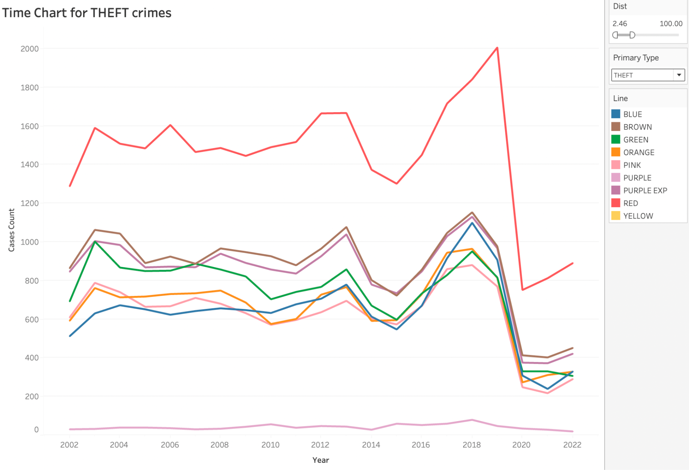	
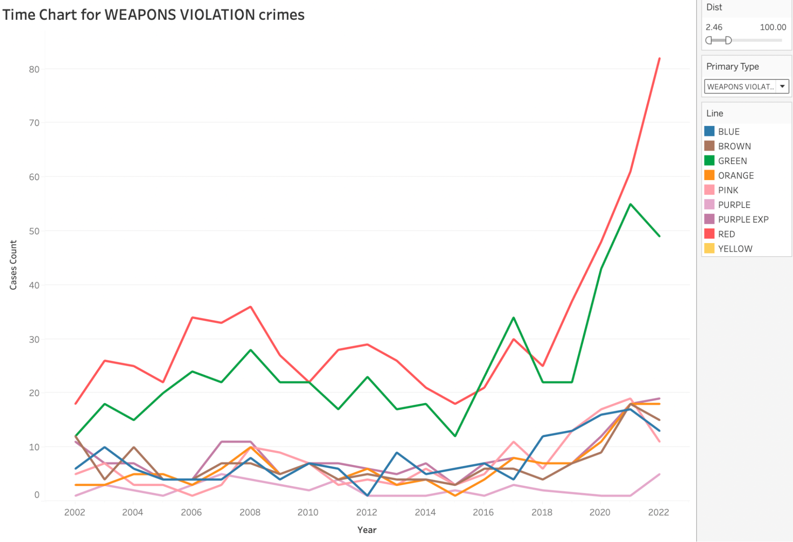	

As seen from the above visualizations in Tableau we can observe that for a distance threshold of 100 Meters the Red CTA line has the highest Assault, robbery, battery and theft crimes. The Visualization also shows that a lot of crimes are associated in the downtown and southern part of the Chicago city where Red and Green lines travel to. 

part b: Observation according to the time when crime took place.
	
	
	
	
	

According to the date and time information the visualizations suggests the following:
1: A lot of robbery crimes around the 100 meter radius of the metro stations increases as the day passes and slows down after midnight. While assault crimes increase during the morning with its peak during 4 pm afternoon. Note that this Visualization can be further broken down according to the Lines using Filters on Tableau.

2: On analyzing the data according to the days, it suggests that for Assault, Wednesday has the highest crime rate. While for Theft, Friday has the highest crime level.

3: On Comparing the overall crime level on a monthly basis we can see that, crime levels for both Assault and Theft for the Red CTA line  lowers during the cold winter months. Suggesting that a lot of less people travel during the winter,

Limitations:
One of the biggest drawbacks is that this data is considering the overall crimes and is not just specific to the CTA metro crimes. Hence the data can be further cleaned by focusing on just Metro crimes to improve the analysis of this study. 

