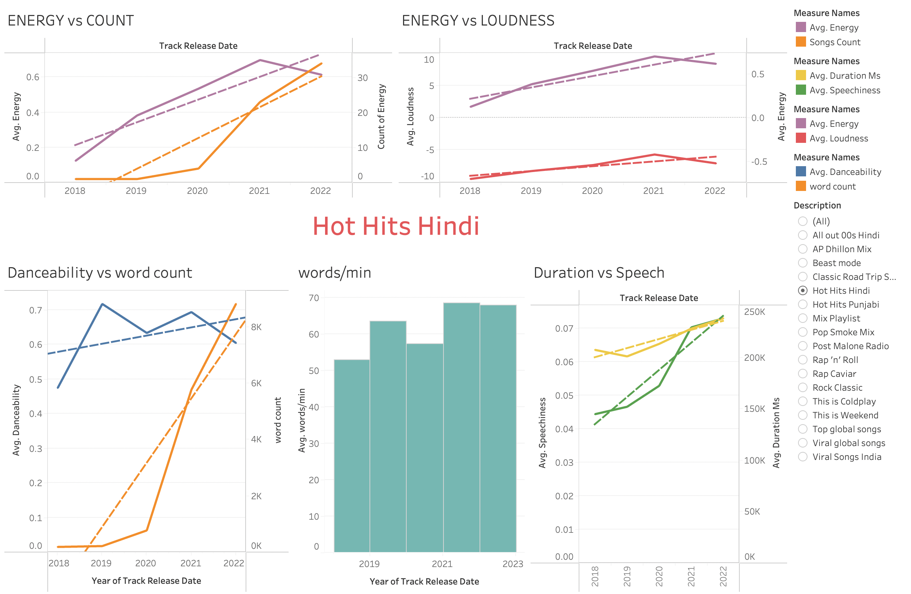

# Music Analysis

Music analysis is an important tool for understanding and appreciating music. It provides a way to examine the structure and content of a piece of music in detail, allowing us to gain a deeper understanding of its complexities and nuances. Through music analysis, we can identify the patterns and structures that give a piece of music its unique character, and we can explore the historical and cultural context that shapes its meaning and significance. Music analysis can also help us to appreciate the technical and artistic skill involved in creating a piece of music, and to better understand the creative choices made by the composer or performer.

In this project, I have collected data from various spotify playlists using Spotipy Library in Python. The data such as danceability, energy, loudness, speechiness, acoustincness, liveness, tempo, duration, artist information, release date etc is collected. Further to collect song lyrics, I'm using selenium which allows web automation and scraping of data. The entire data is collected in a csv format and further analyzed using Tableau.

{% include elements/button.html link="https://github.com/akshant10/akshant10.github.io/blob/a775e7840920320fffe6b2f2e78c0718106bdc1e/project%20data/database_music.csv" text="Link to Dataset" %}

