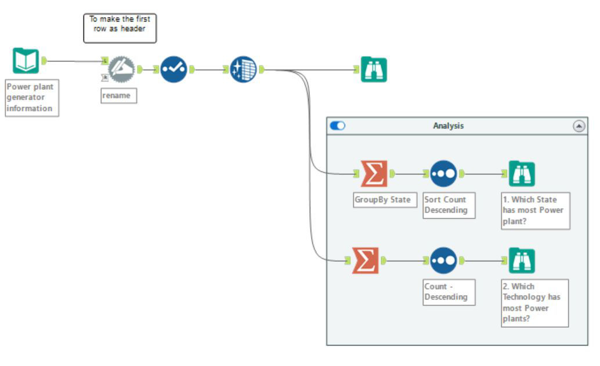



Energy is the power or capacity to do work. Electric Energy is caused by the movement of electric charges called electrons. The energy resources fall into two main categories, often called renewable and non-renewable energy resources We intend to do a deep analysis of how are we performing in minimizing our usage of non-renewable energy v/s to increased usage and popularity of renewable energy. We later on delve deep into one single region and show(through visualizations) the prospect places to harness renewable energy.

To conduct an analysis of the energy dataset, I first collected data from multiple sources that contained information on the amount of terawatt hours (TWH) consumed. Using the data integration and transformation capabilities of Alteryx, I then successfully merged the individual datasets into a single, comprehensive dataset for analysis.

In the above figure, first I have selected desired columns using the select tool. Next, I'm joining the datasets using multiple join tool. As seen the output is then filtered just to get the USA records only and saved into an output excel file. Once the data has been properly prepared, various analysis techniques can be applied to identify trends and patterns in energy consumption. Common approaches include time series analysis which is shown below. 

